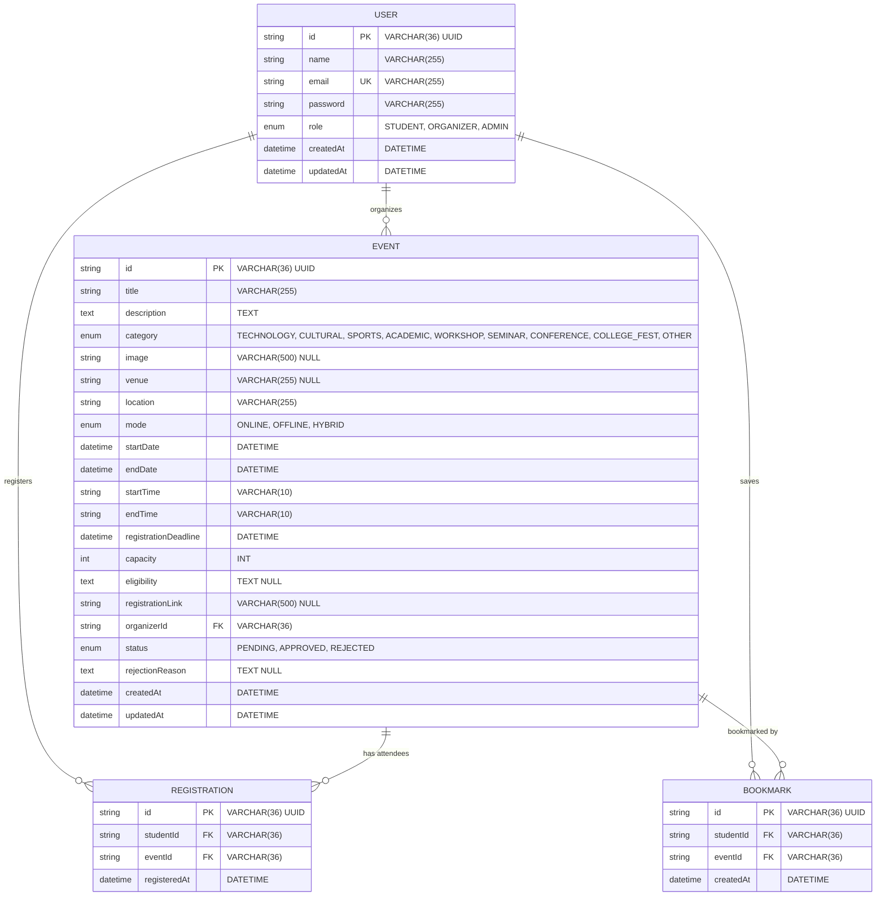

# Event Module — Database Schema

## 1. Entity-Relationship Diagram

---

## 2. Table Specifications

### Table: `users`
Represents platform actors partitioned by role permissions.

| Column | Type | Nullable | Default | Constraints / Description |
| :--- | :--- | :--- | :--- | :--- |
| `id` | `VARCHAR(36)` | No | — | Primary Key (UUID v4) |
| `name` | `VARCHAR(255)` | No | — | Full display name |
| `email` | `VARCHAR(255)` | No | — | Unique login email identifier |
| `password` | `VARCHAR(255)` | No | — | Bcrypt hashed password (10 rounds) |
| `role` | `ENUM('STUDENT', 'ORGANIZER', 'ADMIN')` | No | `'STUDENT'` | Access control role |
| `createdAt` | `DATETIME` | No | — | Account creation timestamp |
| `updatedAt` | `DATETIME` | No | — | Profile update timestamp |

---

### Table: `events`
Represents scheduled campus events with discovery tags, capacity constraints, and administrative approval state.

| Column | Type | Nullable | Default | Constraints / Description |
| :--- | :--- | :--- | :--- | :--- |
| `id` | `VARCHAR(36)` | No | — | Primary Key (UUID v4) |
| `title` | `VARCHAR(255)` | No | — | Event headline |
| `description` | `TEXT` | No | — | Comprehensive event breakdown |
| `category` | `ENUM(...)` | No | — | Discovery category (9 categories) |
| `image` | `VARCHAR(500)` | Yes | `NULL` | Public banner image URL |
| `venue` | `VARCHAR(255)` | Yes | `NULL` | Room or auditorium designation |
| `location` | `VARCHAR(255)` | No | — | Physical address or Online URL label |
| `mode` | `ENUM('ONLINE', 'OFFLINE', 'HYBRID')` | No | — | Delivery modality |
| `startDate` | `DATETIME` | No | — | Start date of the event |
| `endDate` | `DATETIME` | No | — | End date of the event |
| `startTime` | `VARCHAR(10)` | No | — | Daily start time (e.g. "09:30") |
| `endTime` | `VARCHAR(10)` | No | — | Daily end time (e.g. "17:00") |
| `registrationDeadline` | `DATETIME` | No | — | Closing threshold for registrations |
| `capacity` | `INT` | No | — | Maximum attendee limit |
| `eligibility` | `TEXT` | Yes | `NULL` | Prerequisites or restrictions |
| `registrationLink` | `VARCHAR(500)` | Yes | `NULL` | Optional external link |
| `organizerId` | `VARCHAR(36)` | No | — | Foreign key referencing `users(id)` |
| `status` | `ENUM('PENDING', 'APPROVED', 'REJECTED')` | No | `'PENDING'` | Moderation approval status |
| `rejectionReason` | `TEXT` | Yes | `NULL` | Feedback supplied by admin |
| `createdAt` | `DATETIME` | No | — | Record creation timestamp |
| `updatedAt` | `DATETIME` | No | — | Record update timestamp |

---

### Table: `registrations`
Links students to enrolled events with uniqueness enforcement.

| Column | Type | Nullable | Default | Constraints / Description |
| :--- | :--- | :--- | :--- | :--- |
| `id` | `VARCHAR(36)` | No | — | Primary Key (UUID v4) |
| `studentId` | `VARCHAR(36)` | No | — | Foreign key referencing `users(id)` |
| `eventId` | `VARCHAR(36)` | No | — | Foreign key referencing `events(id)` |
| `registeredAt` | `DATETIME` | No | — | Registration enrollment timestamp |

**Indexes & Constraints**:
- `UNIQUE KEY (studentId, eventId)`: Prevents duplicate registrations.
- `KEY (eventId)`: Optimizes registration count and attendee lookups.
- `FOREIGN KEY (studentId) REFERENCES users(id) ON DELETE CASCADE`.
- `FOREIGN KEY (eventId) REFERENCES events(id) ON DELETE CASCADE`.

---

### Table: `bookmarks`
Links students to saved events for personalized discoverability.

| Column | Type | Nullable | Default | Constraints / Description |
| :--- | :--- | :--- | :--- | :--- |
| `id` | `VARCHAR(36)` | No | — | Primary Key (UUID v4) |
| `studentId` | `VARCHAR(36)` | No | — | Foreign key referencing `users(id)` |
| `eventId` | `VARCHAR(36)` | No | — | Foreign key referencing `events(id)` |
| `createdAt` | `DATETIME` | No | — | Bookmarking timestamp |

**Indexes & Constraints**:
- `UNIQUE KEY (studentId, eventId)`: Prevents redundant bookmarks.
- `KEY (eventId)`: Fast indexing for event bookmark metrics.
- `FOREIGN KEY (studentId) REFERENCES users(id) ON DELETE CASCADE`.
- `FOREIGN KEY (eventId) REFERENCES events(id) ON DELETE CASCADE`.

---

## 3. MySQL 5.5 Compatibility Highlights

1. **767-Byte Index Prefix Restriction**:
   - In MySQL 5.5 with default Antelope storage format and `utf8` (3 bytes/char) or `utf8mb4` (4 bytes/char), index length cannot exceed 767 bytes.
   - All primary keys and indexed foreign keys use explicit `VARCHAR(36)` (36 × 4 = 144 bytes), well below the 767-byte limit.
2. **Storage Engine**:
   - Explicit `ENGINE=InnoDB` ensures transactions, referential integrity, and cascading deletions.
3. **Collation**:
   - Default character set `utf8` with collation `utf8_unicode_ci` provides universal Unicode compatibility in MySQL 5.5 without configuration errors.
