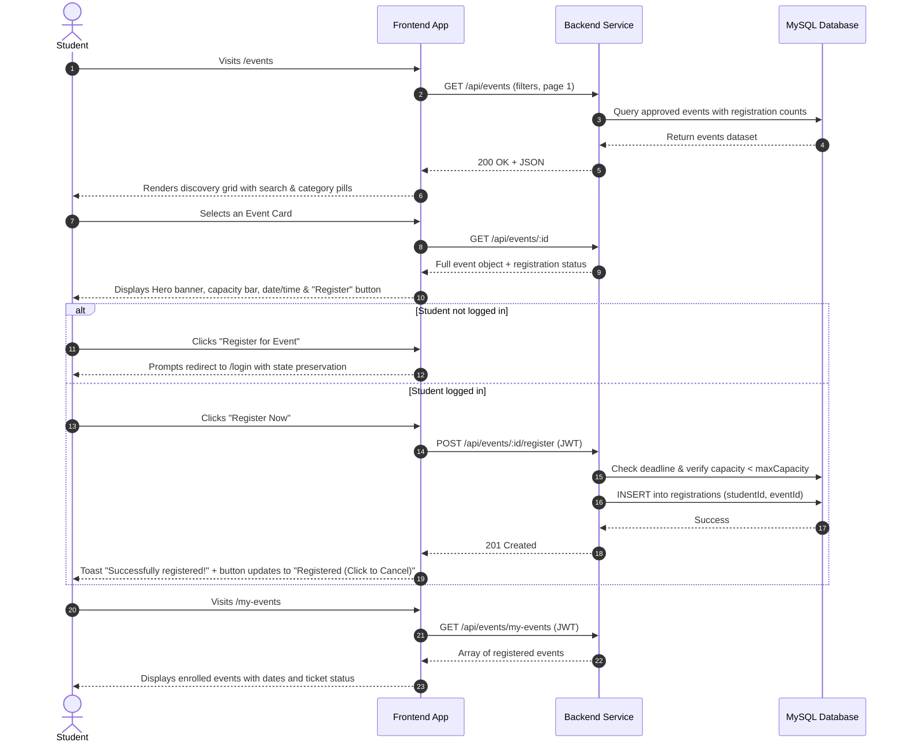
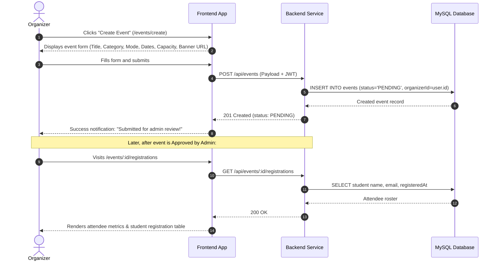

# Event Module — User Flow & Journey Specifications

This document outlines the step-by-step user journeys and system state transitions across all supported roles: **Student**, **Organizer**, and **Administrator**.

---

## 1. Student Journey: Discovery to Registration



---

## 2. Organizer Journey: Event Creation to Attendee Management



---

## 3. Administrator Journey: Moderation & Approvals

```mermaid
sequenceDiagram
    autonumber
    actor Admin
    participant UI as Frontend App
    participant API as Backend Service
    participant DB as MySQL Database

    Admin->>UI: Navigates to /admin/events
    UI->>API: GET /api/admin/events (JWT)
    API-->>UI: List of all events across statuses (Pending, Approved, Rejected)
    UI-->>Admin: Displays moderation dashboard with live status cards

    Admin->>UI: Selects "Pending Review" tab
    UI-->>Admin: Lists unapproved events with organizer contact info

    alt Approve Event
        Admin->>UI: Clicks "Approve" button
        UI->>API: PATCH /api/admin/events/:id/approve
        API->>DB: UPDATE events SET status='APPROVED', rejectionReason=NULL
        DB-->>API: Updated record
        API-->>UI: 200 OK
        UI-->>Admin: Event badge transitions to "Approved"; immediately live on /events
    else Reject Event
        Admin->>UI: Clicks "Reject" button
        UI-->>Admin: Opens modal prompting for rejection reason
        Admin->>UI: Enters "Please upload a clearer venue layout map" & confirms
        UI->>API: PATCH /api/admin/events/:id/reject { reason: "..." }
        API->>DB: UPDATE events SET status='REJECTED', rejectionReason='...'
        DB-->>API: Updated record
        API-->>UI: 200 OK
        UI-->>Admin: Event marked "Rejected" with reason recorded
    end
```

---

## 4. Edge Cases & Validation Rules

| Scenario | Condition | System Behavior |
| :--- | :--- | :--- |
| **Capacity Reached** | Registrations count >= Event Capacity | Register button becomes disabled showing **"Event Full"**. Backend rejects any further registration attempts with HTTP `400 Bad Request`. |
| **Deadline Expired** | Current time > `registrationDeadline` | Register button shows **"Registration Closed"**. Backend validates timestamp and prevents enrollment. |
| **Duplicate Registration**| Student clicks register a second time | Uniqueness constraint `(studentId, eventId)` prevents duplicate rows; backend returns HTTP `409 Conflict`. |
| **Non-Student Registration**| Organizer or Admin tries to register | UI explains that only student accounts can enroll in events; redirects or encourages Student demo profile. |
| **Unauthorized Modification**| Organizer tries to edit another organizer's event | Backend checks `event.organizerId === req.user.id`; returns HTTP `403 Forbidden` if mismatched. |
| **Pending Event Discovery**| Unauthenticated user views `/events` | Only events with `status === 'APPROVED'` are returned in public discovery queries. |
